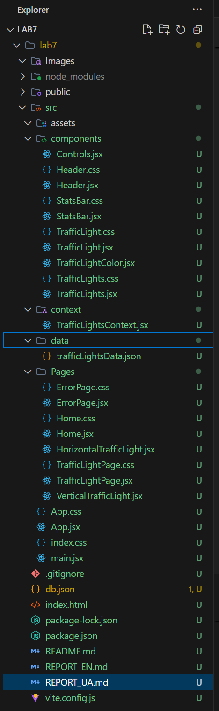
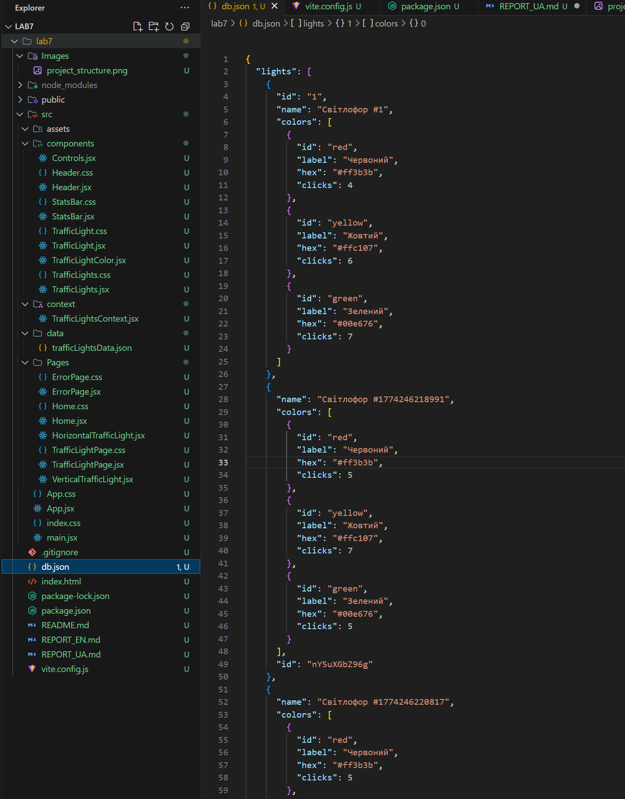
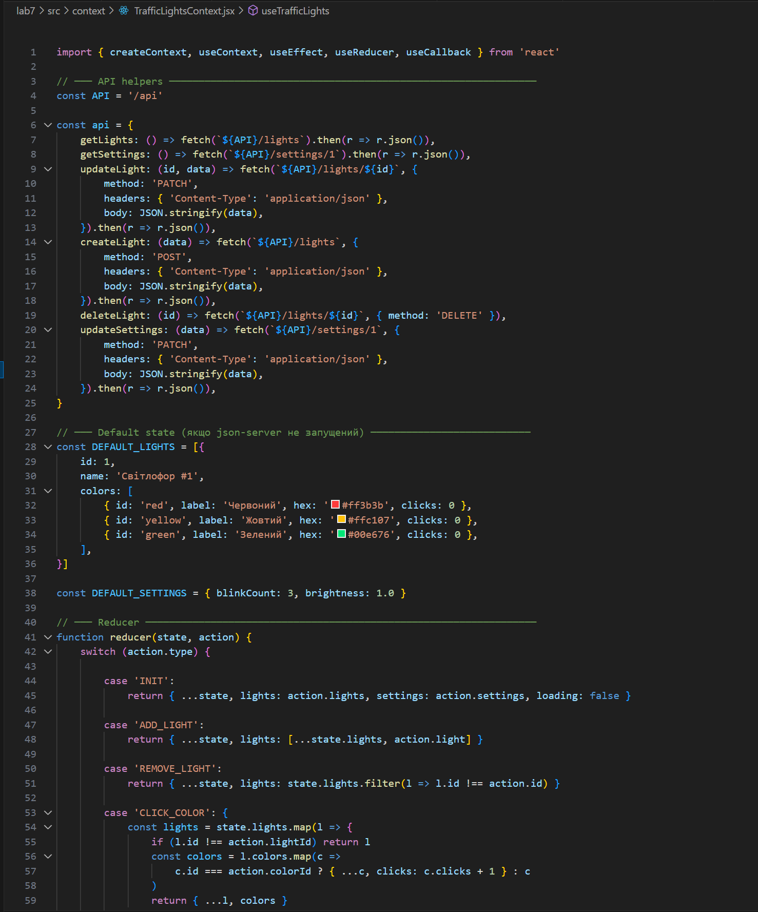
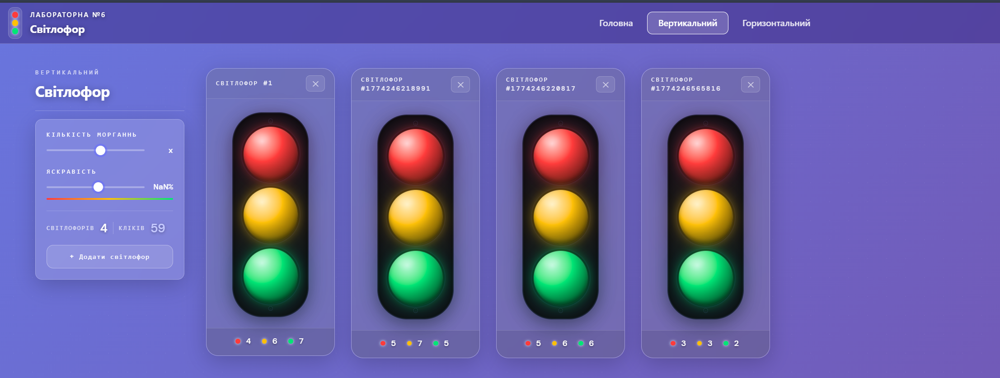
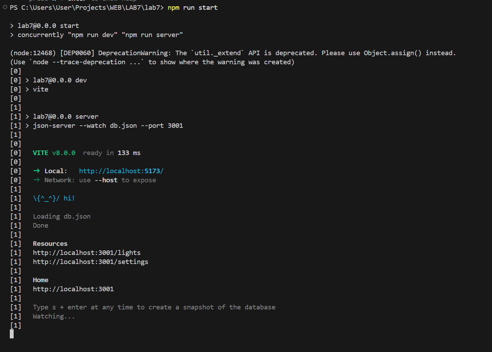
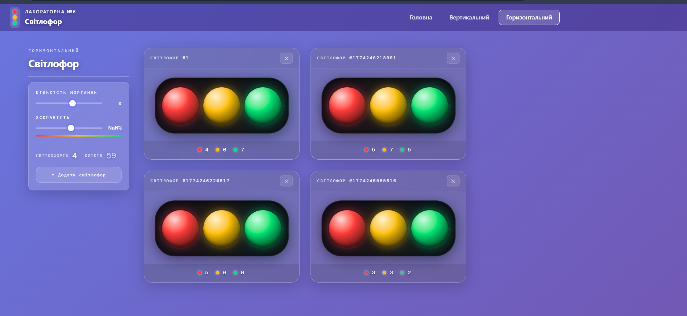

# Laboratory Report No. 7

**Student:** Andriy Vlonha  
**Group:** 42-CS  
**Date:** 21/03/2026

---

## Objective

To learn how to work with React Context API. Refactor Laboratory Work No. 6 using context instead of local state. Install and integrate the `json-server` library to persist data between page reloads.

---

## Procedure

---

### 1. Creating the Project Based on Lab 6

Copied the `traffic-lights-6` project as a base and installed new dependencies:

```bash
npm install
npm install json-server concurrently
```

**Added to `package.json`:**

```json
"scripts": {
  "server": "json-server --watch db.json --port 3001",
  "start": "concurrently \"npm run dev\" \"npm run server\""
},
"devDependencies": {
  "concurrently": "^8.2.2",
  "json-server": "^0.17.4"
}
```

---

### 2. Project Structure

**Screenshot:**
<div align="center">
  <figure>
    
    <br/>
    <sub><b>Fig. 1:</b> Project structure for traffic-lights-7</sub>
  </figure>
</div>

---

### 3. Creating db.json

Implemented data storage structure for the traffic light:

**File: `db.json`**

```json
{
  "lights": [
    {
      "id": 1,
      "name": "Traffic Light #1",
      "colors": [
        { "id": "red",    "label": "Red",    "hex": "#ff3b3b", "clicks": 0 },
        { "id": "yellow", "label": "Yellow", "hex": "#ffc107", "clicks": 0 },
        { "id": "green",  "label": "Green",  "hex": "#00e676", "clicks": 0 }
      ]
    }
  ],
  "settings": {
    "id": 1,
    "blinkCount": 3,
    "brightness": 1.0
  }
}
```

**Description:**
- `lights` — array of traffic lights with colors and click counts
- `settings` — global settings (blink count, brightness)
- json-server automatically creates a REST API from this file

**Screenshot:**
<div align="center">
  <figure>
    
    <br/>
    <sub><b>Fig. 2:</b> db.json structure after several clicks</sub>
  </figure>
</div>

---

### 4. Configuring vite.config.js (proxy)

To avoid CORS errors when making requests to json-server:

**File: `vite.config.js`**

```js
export default defineConfig({
  plugins: [react()],
  server: {
    proxy: {
      '/api': {
        target: 'http://localhost:3001',
        rewrite: (path) => path.replace(/^\/api/, ''),
      },
    },
  },
})
```

**Description:**
- Requests to `/api/lights` are proxied to `http://localhost:3001/lights`
- Vite and json-server run on different ports (5173 and 3001)

---

### 5. Creating TrafficLightsContext (main task)

**File: `src/context/TrafficLightsContext.jsx`**

```jsx
import { createContext, useContext, useEffect, useReducer, useCallback } from 'react'

const TrafficLightsContext = createContext(null)

export function TrafficLightsProvider({ children }) {
  const [state, dispatch] = useReducer(reducer, {
    lights: [], settings: { blinkCount: 3, brightness: 1.0 }, loading: true,
  })

  // Load data from json-server on mount
  useEffect(() => {
    Promise.all([api.getLights(), api.getSettings()])
      .then(([lights, settings]) => {
        dispatch({ type: 'INIT', lights, settings })
      })
      .catch(() => {
        dispatch({ type: 'INIT', lights: DEFAULT_LIGHTS, settings: DEFAULT_SETTINGS })
      })
  }, [])

  const addLight = useCallback(async () => {
    const newLight = { name: `Traffic Light #${Date.now()}`, colors: [...] }
    const saved = await api.createLight(newLight)   // POST /api/lights
    dispatch({ type: 'ADD_LIGHT', light: saved })
  }, [])

  const clickColor = useCallback(async (lightId, colorId) => {
    dispatch({ type: 'CLICK_COLOR', lightId, colorId })
    await api.updateLight(lightId, { colors: updatedColors }) // PATCH /api/lights/:id
  }, [state.lights])

  return (
    <TrafficLightsContext.Provider value={{
      lights, settings, loading, addLight, removeLight, clickColor, updateSettings
    }}>
      {children}
    </TrafficLightsContext.Provider>
  )
}

export function useTrafficLights() {
  return useContext(TrafficLightsContext)
}
```

**Description:**
- `createContext()` — creates a container for global state
- `TrafficLightsProvider` — wraps the app and provides state to all child components
- `useReducer` — manages complex state through actions
- `useTrafficLights()` — hook for accessing context from any component
- Every action (click, add) is saved to `db.json` via json-server

**Screenshot:**
<div align="center">
  <figure>
    
    <br/>
    <sub><b>Fig. 3:</b> TrafficLightsContext.jsx file</sub>
  </figure>
</div>

---

### 6. Wrapping the App in Provider

**File: `src/main.jsx`**

```jsx
// Lab 6:
createRoot(document.getElementById('root')).render(
  <StrictMode>
    <App />
  </StrictMode>
)

// Lab 7:
createRoot(document.getElementById('root')).render(
  <StrictMode>
    <TrafficLightsProvider>
      <App />
    </TrafficLightsProvider>
  </StrictMode>
)
```

**Description:**
- Provider wraps the entire app
- Any component inside can access the state via `useTrafficLights()`

---

### 7. Refactoring Pages (useState → useContext)

**File: `src/Pages/VerticalTrafficLight.jsx`**

```jsx
// Lab 6:
const [lights, setLights]         = useState([makeLight(1)])
const [blinkCount, setBlinkCount] = useState(3)
const [brightness, setBrightness] = useState(1.0)
const addLight = () => setLights(p => [...p, makeLight(Date.now())])

// Lab 7:
const { lights, settings, addLight, removeLight, clickColor, updateSettings }
  = useTrafficLights()
// useState completely removed — state comes from context
```

**Screenshot:**
<div align="center">
  <figure>
    
    <br/>
    <sub><b>Fig. 4:</b> Vertical traffic light page</sub>
  </figure>
</div>

---

### 8. REST API Requests to json-server

```js
const api = {
  getLights:      ()         => fetch('/api/lights').then(r => r.json()),
  getSettings:    ()         => fetch('/api/settings/1').then(r => r.json()),
  createLight:    (data)     => fetch('/api/lights', {
    method: 'POST', headers: { 'Content-Type': 'application/json' },
    body: JSON.stringify(data)
  }).then(r => r.json()),
  updateLight:    (id, data) => fetch(`/api/lights/${id}`, {
    method: 'PATCH', headers: { 'Content-Type': 'application/json' },
    body: JSON.stringify(data)
  }).then(r => r.json()),
  deleteLight:    (id)       => fetch(`/api/lights/${id}`, { method: 'DELETE' }),
  updateSettings: (data)     => fetch('/api/settings/1', {
    method: 'PATCH', headers: { 'Content-Type': 'application/json' },
    body: JSON.stringify(data)
  }).then(r => r.json()),
}
```

---

### 9. Running the Project

```bash
npm run start
```

Starts simultaneously:
- Vite dev server → `http://localhost:5173`
- json-server → `http://localhost:3001`

**Screenshot:**
<div align="center">
  <figure>
    
    <br/>
    <sub><b>Fig. 5:</b> Result of executing <code>npm run start</code></sub>
  </figure>
</div>

---

### 10. Demonstrating Data Persistence

**Screenshot:**
<div align="center">
  <figure>
    
    <br/>
    <sub><b>Fig. 6:</b> Horizontal traffic light page — data persists after F5</sub>
  </figure>
</div>

---

## Results

### Implemented Features:

1. **React Context API:**
   - Created `TrafficLightsContext` with `createContext()`
   - Created `TrafficLightsProvider` with `useReducer` for state management
   - Created `useTrafficLights()` hook for context access
   - Refactored pages — removed `useState`, replaced with `useContext`

2. **json-server:**
   - Installed and configured `json-server`
   - Implemented `db.json` structure (lights, colors, clicks, settings)
   - Implemented REST API requests: GET, POST, PATCH, DELETE
   - Data persists between page reloads

3. **useReducer:**
   - Single reducer handles all state changes via actions
   - Actions: `INIT`, `ADD_LIGHT`, `REMOVE_LIGHT`, `CLICK_COLOR`, `UPDATE_SETTINGS`

4. **proxy (vite.config.js):**
   - `/api/*` proxied to `http://localhost:3001`
   - Avoids CORS errors

5. **Preserved from Lab 6:**
   - framer-motion blink animation
   - Brightness and blink count sliders
   - React Router navigation
   - Multiple traffic lights

### Technical Details:

- **Context API:** `createContext`, `useContext`, `Provider`
- **useReducer:** actions-based state management
- **json-server:** mock REST API from db.json
- **concurrently:** parallel process execution
- **fetch API:** GET, POST, PATCH, DELETE requests
- **vite proxy:** request forwarding without CORS

---

## Conclusion

During this laboratory work, I successfully:
- Mastered working with React Context API
- Created `TrafficLightsProvider` with global state
- Refactored pages from `useState` to `useContext`
- Installed and integrated `json-server`
- Implemented data persistence in `db.json`
- Implemented full REST API interaction (GET, POST, PATCH, DELETE)
- Preserved and extended functionality from the previous lab

---

## References

- GitHub Repository: [link](https://github.com/AndriyVlonha/Lab7_WEB)
- React Context API: https://react.dev/reference/react/createContext
- useReducer: https://react.dev/reference/react/useReducer
- json-server: https://www.npmjs.com/package/json-server
- React Router v7: https://reactrouter.com/en/main

---